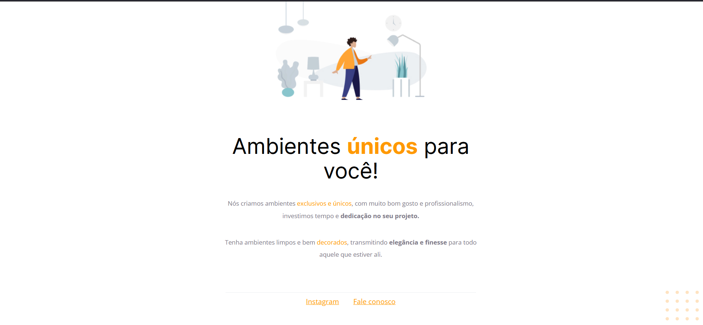
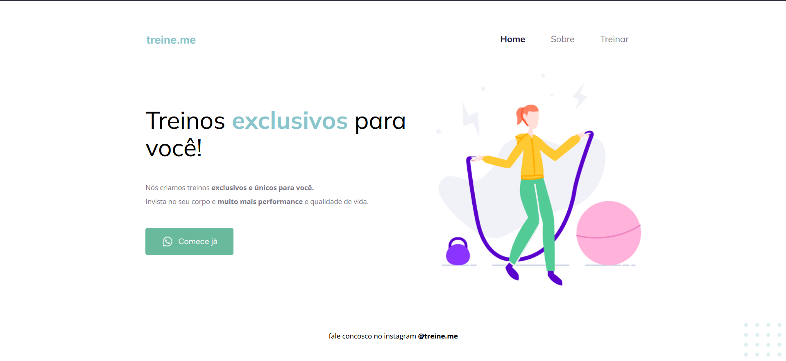

# Projetos HTML + CSS

## Projeto 1

<<<<<<< HEAD

=======

>>>>>>> 49006ab6df89f63f7b56df302de46c01277f7c4e

## Projeto Extra

## Projeto 2

<<<<<<< HEAD

=======

>>>>>>> 49006ab6df89f63f7b56df302de46c01277f7c4e

### Referência

 - [Rocketseat](https://www.rocketseat.com.br)
